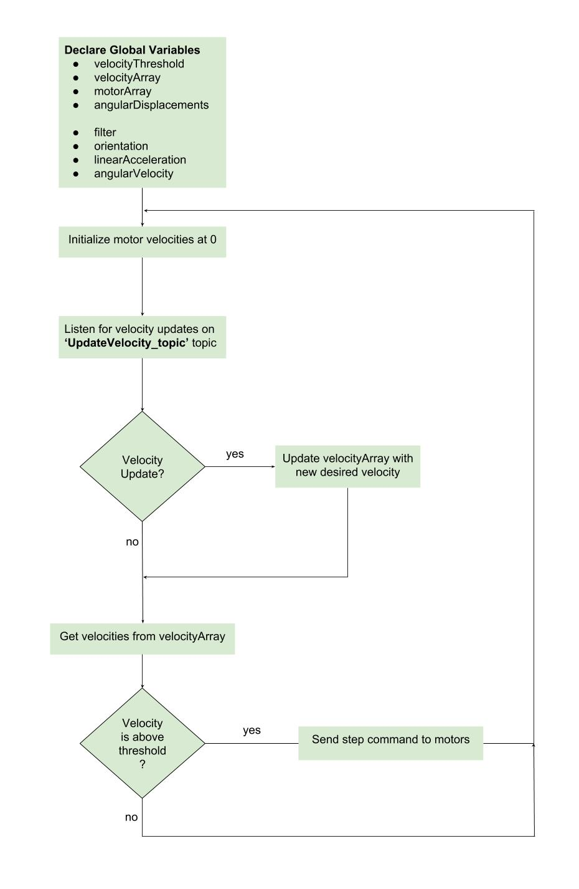

# Code Base

## Launch Files
### Omnibot
'launch/omnibot.launch'

Starts up nodes for production. Robot listens for velocity updates.
``` xml
<launch>
   <!-- Start Ultrasound Node -->
  <node name="ultrasoundPublisher_node" pkg="omnibot" type="ultrasoundPublisher_node.py" />
   <!-- Start ROSserial node -->
  <node name="arduino_node" pkg="omnibot" type="start_rosserial.sh" />
</launch>
```
### Omnibot Dev
'launch/omnibot_dev.launch'

Starts up nodes for development and troubleshooting. Robot listens to incoming velocities from velocityPublisher node.
``` xml
<launch>
  <!--  Start velocityPublisher Node-->
  <node name="velocityPublisher_node" pkg="omnibot" type="velocityPublisher_node.py" />
  <!--  Start Ultrasound Node -->
  <node name="ultrasoundPublisher_node" pkg="omnibot" type="ultrasoundPublisher_node.py" />
  <!--  Start ROSserial Node-->
  <node name="arduino_node" pkg="omnibot" type="start_rosserial.sh" />
</launch>
```
## Script Files
### Ultrasound Node
'scripts/ultrasoundPublisher_node.py'

Publishes an integer value representing distance to target in millimeters
``` python
#!/usr/bin/python
from time import time
from serial import Serial # import library allowing python to interact with serial port
import rospy
from std_msgs.msg import Int8 # distance acquired will be fit into an 8bit variable

serialDevice = "/dev/ttyAMA0" # default for RaspberryPi
maxwait = 5 # seconds to try for a good reading before quitting

# Function was obtained from the Maxbotix website.
# https://www.maxbotix.com/wp-content/uploads/2017/09/074_raspPi.txt
def get_measurement(portName):
    ser = Serial(portName, 9600, 8, 'N', 1, timeout=1)
    timeStart = time()
    valueCount = 0

    while time() < timeStart + maxwait:
        if ser.inWaiting():
            bytesToRead = ser.inWaiting()
            valueCount += 1
            if valueCount < 2: # 1st reading may be partial number; throw it out
                continue
            testData = ser.read(bytesToRead)
            if not testData.startswith(b'R'):
                # data received did not start with R
                continue
            try:
                sensorData = testData.decode('utf-8').lstrip('R')
            except UnicodeDecodeError:
                # data received could not be decoded properly
                continue
            try:
                mm = int(sensorData)
            except ValueError:
                # value is not a number
                continue
            ser.close()
            return(mm)

    ser.close()
    raise RuntimeError("Expected serial data not received")

def publish_measurement(portName):
    # Declare publisher
    # Transmitting to => ultrasoundDistance_topic
    # Using the 'Int8' message type
    # A maximnum of 10 messages will be held in the message queue.
    pub = rospy.Publisher('ultrasoundDistance_topic', Int8, queue_size=10)
    rospy.init_node('ultrasoundPublisher_node')
    # 10 readings will be published per second
    rate = rospy.Rate(10) # 10hz

    # This keeps the node running until the script is shut down manually.
    # node will keep cycling at the frequncy set above.
    while not rospy.is_shutdown():
        # obtain measurement
        measurement = get_measurement(portName)

        # Log measurment to the terminal.
        rospy.loginfo(measurement)
        # publish measurmeent to the 'ultrasoundDistance_topic'.
        pub.publish(measurement)
        # Causes ROS to pause, to ensure its cycleing at the frequency set above.
        rate.sleep()

if __name__ == '__main__':
    publish_measurement(serialDevice)
```


## ROSserial (Arduino)
### Start ROSserial Node
'scripts/start_rosserial.bash'

Starts up rosserial node (arduino). Run only after arduino is physically connected.
``` bash
#!/bin/bash
rosrun rosserial_python serial_node.py _port:=/dev/ttyACM0
```
### Motors Only (No ROS)
'scripts/arduino/basicMotor_noROS.ino'

Starts up three step motors at 60 rpms each. ROS is not needed, as script starts up automatically with power source.
``` c++
#include <Wire.h>
#include <Adafruit_MotorShield.h> // library nbeeded to interact with motorshields

// Declare motorshield objects at their locations
Adafruit_MotorShield AFMStop(0x61);
Adafruit_MotorShield AFMSbot(0x60);

// Get motor handler objects from motorshield objects
// Documentation on motors states 200 steps per rev
// AFMStop.getStepper(200, 2) => AFMStop.getStepper(#OfSteps, motorShieldPort#)
Adafruit_StepperMotor *stepMotor_1 = AFMStop.getStepper(200, 2);
Adafruit_StepperMotor *stepMotor_2 = AFMSbot.getStepper(200, 1);
Adafruit_StepperMotor *stepMotor_3 = AFMSbot.getStepper(200, 2);

// NOTE velocities are in rpm!!!!
float stepMotor1_vel= 60;
float stepMotor2_vel= 60;
float stepMotor3_vel= 60;

void setup()
{  
  AFMSbot.begin(); // Initialize the bottom shield
  AFMStop.begin(); // Initialize the top shield

  stepMotor_1->setSpeed(stepMotor1_vel); // top 
  stepMotor_2->setSpeed(stepMotor2_vel); // bot
  stepMotor_3->setSpeed(stepMotor3_vel); // bot
}

void loop()
{
  // NOTE => step(#OfSteps, direction, stepType)
  
  // clockwise
  stepMotor_1->step(1, FORWARD, DOUBLE);
  // counter-clockwise
  stepMotor_2->step(1, BACKWARD, DOUBLE);
  // clockwise
  stepMotor_3->step(1, FORWARD, DOUBLE);
}
```
### Motor Control Flow (w/ROS)
Below is a simplified version of teh arduino control loop and ROS cycle, when controlling the step motors.


### Motors Only (w/ ROS)
'scripts/arduino/basicMotor_wROS.ino'

Starts up three step motors at 0 rpms each. ROS is used to subscribe for velocity updates. Velocities are not actuaized until a power source is connected. Features 2 publsihers that transmit angular displacements and velocities of each motor.
``` c++
#include <Wire.h>
#include <Adafruit_MotorShield.h> // library nbeeded to interact with motorshields
#include <ros.h> // library needed for ROS communication
#include <omnibot/MotorArray.h> // library needed for custom ROS 'MotorArray' msg type

ros::NodeHandle nh; // Instantiate ros handler object

// Declare motorshield objects
// This allows us to then interact with motors attached to our
// motorshields.
Adafruit_MotorShield AFMStop(0x61);
Adafruit_MotorShield AFMSbot(0x60);

// Initialize motor handler objects from the ports on the motorshields.
// AFMStop.getStepper(200, 2) => motorShieldObject.getSTepper
Adafruit_StepperMotor *stepMotor_1 = AFMStop.getStepper(200, 2);
Adafruit_StepperMotor *stepMotor_2 = AFMSbot.getStepper(200, 1);
Adafruit_StepperMotor *stepMotor_3 = AFMSbot.getStepper(200, 2);

// Declare array of step motors
// Array is declared to 4 members, but we only index motors from 1-3
// This was done for clarity of new users.
Adafruit_StepperMotor* motorArray[4];

// Initialize motors at angular_vel=0; available globally
// NOTE => Velocities are in RPMs !!
float velocityArray[4] = {0}; 

// Step motors will vibrate regardless of what velocity is sent to the motor.
// If motor velocity is '0', the motor will still vibrate.
// To avoid this, we define a thershold. if the desired velocity is below 
// this threshold, no step will be issued to the motor.
// The motor velocity variables will still reflect this desired velosity, 
// even if it crosses the threshold.
float velocityThreshold = 0.1;

// Declare custom made variables that will hold our velocities and displacements,
// that will be published to their respective topics.
omnibot::MotorArray currentVelocities;
omnibot::MotorArray angularDisplacements; // NOTE DISPLACEMNTS ARE IN RADIANS!!

// Callback function for 'setStepMotorVelocity_topic' subscriber below. 
// Updates velocity variables from FIFO queue, but does not send a step 
// command to the motors.
// The velocityArray is globally available. After this function updates 
// its values, the array is available for any other function to use.
// The desired values are assign to the velocityArray, rgardless of 
// whether they are wihtin the threshold or not.
void updateMotorVelocities( const omnibot::MotorArray& velocity_msg)
{
  // assign velocityArray values as recieved from 'setStepMotorVelocity_topic' 
  velocityArray[1] = velocity_msg.motor1; velocityArray[2] = velocity_msg.motor2; velocityArray[3] = velocity_msg.motor3;

  // The absolute value of the velocityArray values is sent to the motors.
  // Negative values sent to the motors cause incorrect rotation.
  // To actualize direction (CW and CCW), we use the "BACKWARD"/"FORWARD" parameters in the step command.
  motorArray[1]->setSpeed(abs(velocityArray[1]));
  motorArray[2]->setSpeed(abs(velocityArray[2]));
  motorArray[3]->setSpeed(abs(velocityArray[3]));
}

// Decides whether a desired velocity (absolute value of desired velocity) 
// is above (TRUE) the threshold, or below (FALSE).
bool velocityIsAboveThreshold(float motorVel, float threshold)
{
  if ( abs(motorVel) > threshold ) {
    return true;
  }
  return false;
}

// Grabs the values of the desired velocities, but takes the threshold 
// value nto consideration. If the value is above the threshold, 
// the velocity is returned. if value is below th ethreshold, a '0' is returned.
float getCurrentMotorVelocity(float velocity, float threshold)
{ 
  if (velocityIsAboveThreshold(velocity, threshold)) {
    return velocity;
  }
  return 0;
}

// Calculates the angular displacement, depending on the direction of rotation.
// Our step motors are 200step motors. (Take 200 steps to rotate 360 degrees).
// With each step being 1.8degrees and our velocities being relatively slow, w ecan
// estimate our angular displacement per step as -1.8 || +1.8 dgerees.
// Positive angular velocity (CCW) +1.8 == +0.0314159
// Negative angular velocity (CW) -1.8 == -0.0314159
// If velocity is zero (ie scenarios where vleocity is below threshold), a '0' is
// returned for no angular displacement.
float getAngularDisplacement(float velocity)
{
  if (velocity > 0) {
    return 0.0314159;
  }
  else if(velocity < 0) {
    return -0.0314159;
  }
  else {
    return 0;
  } 
}

// Sends step command to the motors.
// Takes threhsold into consideration. If desired velocity is '0' (ie like when below threshold),
// then no step is issued. No need to send a step command if the velocity is zero.
// This takes positive/negative signs into consideration. If desired velocity is
// Positive angular velocity (CCW) == BACKWARD
// Negative angular velocity (CW) == FORWARD
// Step command is below:
// motorArray[motorNumber]->step(#OfSteps, DIRECTION, stepTYPE)
void motorStep(float motorVel, int motorNumber)
{
  if (velocityIsAboveThreshold(motorVel, velocityThreshold)) {
    if(motorVel < 0) {
      motorArray[motorNumber]->step(1, BACKWARD, DOUBLE); // clockwise
    }
    else {
      motorArray[motorNumber]->step(1, FORWARD, DOUBLE); // counter-clockwise
    }
  }
}

// Initializes the publishers that report our current velocities and 
// angular displacmeents to the Pi.
ros::Publisher currentMotorVelocities_topic("currentMotorVelocities_topic", &currentVelocities);
ros::Publisher angularDisplacements_topic("angularDisplacements_topic", &angularDisplacements);

// Assigns the velocities from our currently desired values to our
// custom motorArray msg object.
void publishCurrentMotorVelocities()
{
  currentVelocities.motor1 = getCurrentMotorVelocity(velocityArray[1], velocityThreshold);
  currentVelocities.motor2 = getCurrentMotorVelocity(velocityArray[2], velocityThreshold);
  currentVelocities.motor3 = getCurrentMotorVelocity(velocityArray[3], velocityThreshold);

  currentMotorVelocities_topic.publish( &currentVelocities );
}

// Assigns the angular displacement (WRT our current iteration's velocity) toour
// custom motorArray msg object.
void publishAngularDisplacements()
{ 
  angularDisplacements.motor1 = getAngularDisplacement(currentVelocities.motor1);
  angularDisplacements.motor2 = getAngularDisplacement(currentVelocities.motor2);
  angularDisplacements.motor3 = getAngularDisplacement(currentVelocities.motor3);

  angularDisplacements_topic.publish( &angularDisplacements );
}

// Set up motorVelocities subscriber
// The velocity for each stepMotor is declared inside of a custom motorArray ROS msg
// and is recioeved through the 'setStepMotorVelocity_topic'.
ros::Subscriber<omnibot::MotorArray> motorVelocities("setStepMotorVelocity_topic", &updateMotorVelocities );

// Iterates through the stepMotor array and performs the step command (if applicable).
void activateMotors()
{
  for(int i = 1; i < 4; i++)
  {
    motorStep(velocityArray[i], i);
  }
}

void setup()
{
  Serial.begin(115200); // set baud rate
  nh.initNode(); // Initialize ROSserial node

  // notify master of our new publishers and subscribers
  nh.subscribe(motorVelocities);
  nh.advertise(currentMotorVelocities_topic);
  nh.advertise(angularDisplacements_topic);
  
  AFMSbot.begin(); // Initialize the bottom shield
  AFMStop.begin(); // Initialize the top shield

  // add motor instances to our motorArray
  // ommited index=0 for clarity
  motorArray[1] = stepMotor_1;
  motorArray[2] = stepMotor_2;
  motorArray[3] = stepMotor_3;
}

void loop()
{
  // This causes ROS to cycle.
  // Normally (on a multithreaded device) each subscriber
  // works in its own thread. Because this device is 
  // single threaded, this function aids in protothreading and making
  // sure our values are updated accordingly.
  nh.spinOnce();
  
  // Processes current desired velocities and sends the 
  activateMotors();
  
  // step commands ot the motors// Publishes currrent motor velocities to 'currentMotorVelocities_topic'.
  publishCurrentMotorVelocities();  
  // Publishes the angular displacement for the current iteration to 'angularDisplacements_topic'.
  publishAngularDisplacements();
}
```
### Sensors Only (w/ ROS)
'scripts/arduino/basicSensors_wROS.ino'

Begins reading data from arudino's onboard accelerometer and gyroscope. ROS is used to publish linear acceleration, orientation, and angular velocity. External power source not needed (only USB). No subscribers.
``` c++
#include <ros.h> // ROS library
#include <CurieIMU.h> // accelerometer library
#include <MadgwickAHRS.h> // noise filter library
#include <geometry_msgs/Vector3.h> // ROS messages library

// Instantiate ROS handler object.
// (this makes it a ROS node)
ros::NodeHandle nh; 

// preallocate Vector3 variables to hold:
// --------------------------------------
// var orientation = orientation 
// var linearAccel = linear acceleration
// var angularVel = angular velocity
geometry_msgs::Vector3 orientation; 
geometry_msgs::Vector3 linearAccel;
geometry_msgs::Vector3 angularVel;

// Set up publishers for each of the variables above.
// Each of these publishers will publish each of the variables above,
// every time the arduino loop executes (activated by the "spinOnce" on line 141).
ros::Publisher orientation_topic("orientation_topic", &orientation);
ros::Publisher linearAccel_topic("linearAccel_topic", &linearAccel);
ros::Publisher angularVel_topic("angularVel_topic", &angularVel);

// Create a Madgwick object to access the functions from the 
// Madgwick class in the library. Here, we call it filter.
// A prewritten class from ADAFRUIT website that will allow 
// us to get a reading from the onboard gyroscope and accelerometer.
// https://www.arduino.cc/en/Tutorial/Genuino101CurieIMUOrientationVisualiser
Madgwick filter;

// initialize sensor data variables
unsigned long microsPerReading, microsPrevious;
float accelScale, gyroScale;

// The algorithm takes raw values from a gyroscope and accelerometer, 
// and uses them to return four quaternions:

int aix, aiy, aiz;
int gix, giy, giz;

float ax, ay, az;
float gx, gy, gz;

// which are 4-dimensional numbers which contain x, y, and z values to 
// represent the axis around which rotation occurs, as well as a ω value
// which represents the value of rotation which occurs around the same 
// axis. These quaternions can be used to calculate the Euler angles 
// pitch, yaw, and roll.

float roll, pitch, heading;
unsigned long microsNow;

// Helper functions for translating quarternion readings.
// Both are used in 'publishLinearAccelAndangularVel()'
float convertRawAcceleration(int aRaw) {
  // since we are using 2G range
  // -2g maps to a raw value of -32768
  // +2g maps to a raw value of 32767

  float a = (aRaw * 2.0) / 32768.0;
  return a;
}
float convertRawGyro(int gRaw) {
  // since we are using 250 degrees/seconds range
  // -250 maps to a raw value of -32768
  // +250 maps to a raw value of 32767

  float g = (gRaw * 250.0) / 32768.0;
  return g;
}

// This function takes care of three different tasks
// 1) Translatemrat raw quarternion readings to:
//    -Gs for linear accelration (line )
//    -Degrees/sec for angular velocity
// 2) Publish tranlated motion values to their respective topics
// 3) Update the the Madgwick object (the filter) to later obtain 
//    our roll, pitch, and yaw
void publishLinearAccelAndangularVel()
{
  // convert from raw data to gravity and degrees/second units
  ax = convertRawAcceleration(aix);
  ay = convertRawAcceleration(aiy);
  az = convertRawAcceleration(aiz);
  gx = convertRawGyro(gix);
  gy = convertRawGyro(giy);
  gz = convertRawGyro(giz);
  
  // update the filter, which computes orientation
  // we will call this filter in a separata function to get roll, pitch, yaw
  filter.updateIMU(gx, gy, gz, ax, ay, az);

  // attach linear accel and rotational vel values for publishing
  linearAccel.x = ax;
  linearAccel.y = ay;
  linearAccel.z = az;
  angularVel.x = gx;
  angularVel.y = gy;
  angularVel.z = gz;

  // publish values
  linearAccel_topic.publish( &linearAccel );
  angularVel_topic.publish( &angularVel );
}

// Retrieves roll, pitch, and yaw from the filter (Madgqiwck object)
// and publishes it to the orientation topic.
// Roll, pitch, and yaw are calculated according to the update performed on the filter 
// from 'publishLinearAccelAndangularVel()' function (runs beforehand).
void publishOrientation()
{
  roll = filter.getRoll();
  pitch = filter.getPitch();
  heading = filter.getYaw();

  orientation.x = roll;
  orientation.y = pitch;
  orientation.z = heading;

  orientation_topic.publish( &orientation );
}

// Checks to ensure its time to take a new reading, according to timestep defined
// inside of the 'setup()' function.
// If its time for a reading, linearAcceleration, angularVelocity,a nd orientation are
// all read and published.
void processAndPublishSensorData()
{
  // Timestep is calculated below.
  // Configuration for the itme step is set in the 'setup()' function.
  microsNow = micros();
  if (microsNow - microsPrevious >= microsPerReading) {

    // read raw data from CurieIMU and store in 'aix, aiy, aiz, gix, giy, giz'
    // These variables are available globally!
    CurieIMU.readMotionSensor(aix, aiy, aiz, gix, giy, giz);

    publishLinearAccelAndangularVel();
    publishOrientation();

    // increment previous time, so we keep proper pace
    microsPrevious = microsPrevious + microsPerReading;
  }
}

void setup()
{
  // Set baud rate for serial transmission.
  Serial.begin(115200); 
  // Initilizes the ROS node.
  nh.initNode();  

  // Notify the master node that we have 3 publishers declared above.
  nh.advertise(orientation_topic);
  nh.advertise(linearAccel_topic);
  nh.advertise(angularVel_topic);
  
  // Start the IMU and perform preliminary configuration by 
  // setting the sample rate of the acelerometer and the gyro 
  // and the filter to 25Hz:
  CurieIMU.begin();
  CurieIMU.setGyroRate(25); //25 Hz
  CurieIMU.setAccelerometerRate(25); // 25Hz
  filter.begin(25); // 25Hz

  // Set the accelerometer range to 2G
  CurieIMU.setAccelerometerRange(2);
  
  // Set the gyroscope range to 250 degrees/second
  CurieIMU.setGyroRange(250);

  // initialize variables to pace updates to correct rate
  microsPerReading = 1000000 / 25;
  microsPrevious = micros();
}

void loop()
{
  // This causes ROS to cycle.
  // Normally (on a multithreaded device) each subscriber
  // works in its own thread. Because this device is 
  // single threaded, this function aids in protothreading and making
  // sure our values are updated accordingly.
  nh.spinOnce();

  // This line processes all other functions, preparing and publishing 
  // all outgoing data.
  processAndPublishSensorData();
}
```
### Motors + Sensors (w/ ROS)
'scripts/arduino/motorsAndSensors_wROS.ino'

Starts up three motors and onboard accelerometer/gyroscope.
Subscribes to velocity updates.
Publishes angular dispacmeents, motor velocities, orientation, linear acceleration, and angular velocity.

``` c++
// =================================================
// Motor Libraries [START] -------------------------
#include <Wire.h>
#include <Adafruit_MotorShield.h>
#include <ros.h>
#include <std_msgs/Int64.h>
#include <std_msgs/Float32MultiArray.h>
#include <geometry_msgs/Point.h>
#include <omnibot/MotorArray.h>
// Motor Libraries [END] ---------------------------
// =================================================
// =================================================
// Sensor Libraries [START] ------------------------
#include <CurieIMU.h>
#include <MadgwickAHRS.h>
#include <geometry_msgs/Vector3.h>
// Sensor Libraries [END] --------------------------
// =================================================

ros::NodeHandle nh;

// ==============================================================
// Motor variable declaration [START]----------------------------
Adafruit_MotorShield AFMStop(0x61);
Adafruit_MotorShield AFMSbot(0x60);

Adafruit_StepperMotor *stepMotor_1 = AFMStop.getStepper(200, 2);
Adafruit_StepperMotor *stepMotor_2 = AFMSbot.getStepper(200, 1);
Adafruit_StepperMotor *stepMotor_3 = AFMSbot.getStepper(200, 2);

Adafruit_StepperMotor* motorArray[4];
float velocityArray[4] = {0}; // initialize motors at angular_vel=0; available globally
float velocityThreshold = 0.1;

omnibot::MotorArray currentVelocities;
omnibot::MotorArray angularDisplacements;

ros::Publisher currentMotorVelocities_topic("currentMotorVelocities_topic", &currentVelocities);
ros::Publisher angularDisplacements_topic("angularDisplacements_topic", &angularDisplacements);
// Motor variable declaration [END]------------------------------
// ==============================================================

// ==============================================================
// Sensor variable declaration [START]----------------------------
geometry_msgs::Vector3 orientation;
geometry_msgs::Vector3 linearAccel;
geometry_msgs::Vector3 angularVel;

ros::Publisher linearAccel_topic("linearAccel_topic", &linearAccel);
ros::Publisher angularVel_topic("angularVel_topic", &angularVel);
ros::Publisher orientation_topic("orientation_topic", &orientation);

Madgwick filter;

unsigned long microsPerReading, microsPrevious;
float accelScale, gyroScale;

int aix, aiy, aiz;
int gix, giy, giz;

float ax, ay, az;
float gx, gy, gz;

float roll, pitch, heading;
unsigned long microsNow;
// Sensor variable declaration [END]------------------------------
// ==============================================================

// ==============================================================
// Motor function and callbacks [START]--------------------------
// callback function for subscriber below. Updates velocities from FIFO queue
void updateMotorVelocities( const omnibot::MotorArray& velocity_msg)
{
  velocityArray[1] = velocity_msg.motor1; velocityArray[2] = velocity_msg.motor2; velocityArray[3] = velocity_msg.motor3;

  motorArray[1]->setSpeed(abs(velocityArray[1]));
  motorArray[2]->setSpeed(abs(velocityArray[2]));
  motorArray[3]->setSpeed(abs(velocityArray[3]));
}

bool velocityIsAboveThreshold(float motorVel, float threshold)
{
  if ( abs(motorVel) > threshold ) {
    return true;
  }
  return false;
}

float getCurrentMotorVelocity(float velocity, float threshold)
{
  
  if (velocityIsAboveThreshold(velocity, threshold)) {
    return velocity;
  }
  return 0;
}

float getAngularDisplacement(float velocity)
{
  if (velocity > 0) {
    return 0.0314159;
  }
  else if(velocity < 0) {
    return -0.0314159;
  }
  else {
    return 0;
  } 
}

void motorStep(float motorVel, int motorNumber)
{
  if (velocityIsAboveThreshold(motorVel, velocityThreshold)) {
    if(motorVel < 0) {
      motorArray[motorNumber]->step(1, BACKWARD, DOUBLE); // clockwise
    }
    else {
      motorArray[motorNumber]->step(1, FORWARD, DOUBLE); // counter-clockwise
    }
  }
}

void publishCurrentMotorVelocities()
{
  currentVelocities.motor1 = getCurrentMotorVelocity(velocityArray[1], velocityThreshold);
  currentVelocities.motor2 = getCurrentMotorVelocity(velocityArray[2], velocityThreshold);
  currentVelocities.motor3 = getCurrentMotorVelocity(velocityArray[3], velocityThreshold);

  currentMotorVelocities_topic.publish( &currentVelocities );
}

void publishAngularDisplacements()
{ 
  angularDisplacements.motor1 = getAngularDisplacement(currentVelocities.motor1);
  angularDisplacements.motor2 = getAngularDisplacement(currentVelocities.motor2);
  angularDisplacements.motor3 = getAngularDisplacement(currentVelocities.motor3);

  angularDisplacements_topic.publish( &angularDisplacements );
}

// Set up motorVelocities subscriber
ros::Subscriber<omnibot::MotorArray> motorVelocities("setStepMotorVelocity_topic", &updateMotorVelocities );

void activateMotors()
{
  for(int i = 1; i < 4; i++)
  {
    motorStep(velocityArray[i], i);
  }
}
// Motor function and callbacks [END]----------------------------
// ==============================================================

// ==============================================================
// Sensor function and callbacks [START]--------------------------
float convertRawAcceleration(int aRaw) {
  // since we are using 2G range
  // -2g maps to a raw value of -32768
  // +2g maps to a raw value of 32767

  float a = (aRaw * 2.0) / 32768.0;
  return a;
}

float convertRawGyro(int gRaw) {
  // since we are using 250 degrees/seconds range
  // -250 maps to a raw value of -32768
  // +250 maps to a raw value of 32767

  float g = (gRaw * 250.0) / 32768.0;
  return g;
}

void publishLinearAndangularVel()
{
  ax = convertRawAcceleration(aix);
  ay = convertRawAcceleration(aiy);
  az = convertRawAcceleration(aiz);

  gx = convertRawGyro(gix);
  gy = convertRawGyro(giy);
  gz = convertRawGyro(giz);

  filter.updateIMU(gx, gy, gz, ax, ay, az);

  linearAccel.x = ax;
  linearAccel.y = ay;
  linearAccel.z = az;
  
  angularVel.x = gx;
  angularVel.y = gy;
  angularVel.z = gz;

  linearAccel_topic.publish( &linearAccel );
  angularVel_topic.publish( &angularVel );
}

void publishOrientation()
{
  roll = filter.getRoll();
  pitch = filter.getPitch();
  heading = filter.getYaw();

  orientation.x = roll;
  orientation.y = pitch;
  orientation.z = heading;

  orientation_topic.publish( &orientation );
}

void processAndPublishSensorData()
{
  microsNow = micros();
  if (microsNow - microsPrevious >= microsPerReading) {

    // read raw data from CurieIMU
    CurieIMU.readMotionSensor(aix, aiy, aiz, gix, giy, giz);

    publishLinearAndangularVel();
    publishOrientation();

    // increment previous time, so we keep proper pace
    microsPrevious = microsPrevious + microsPerReading;
  }
}
// Sensor function and callbacks [END]----------------------------
// ==============================================================

void setup()
{
  Serial.begin(115200); // set baud rate
  nh.initNode();

  // =============================================
  // Motor setup [START]--------------------------
  nh.subscribe(motorVelocities);
  nh.advertise(currentMotorVelocities_topic);
  nh.advertise(angularDisplacements_topic);
  
  AFMSbot.begin();
  AFMStop.begin();

  motorArray[1] = stepMotor_1;
  motorArray[2] = stepMotor_2;
  motorArray[3] = stepMotor_3;
  // Motor setup [END]--------------------------
  // ===========================================

  // =============================================
  // Sensor setup [START]--------------------------
  nh.advertise(orientation_topic);
  nh.advertise(linearAccel_topic);
  nh.advertise(angularVel_topic);
  
  CurieIMU.begin();
  CurieIMU.setGyroRate(25);
  CurieIMU.setAccelerometerRate(25);
  filter.begin(25);

  CurieIMU.setAccelerometerRange(2);
  CurieIMU.setGyroRange(250);

  microsPerReading = 1000000 / 25;
  microsPrevious = micros();
  // Sensor setup [END]--------------------------
  // ===========================================
}

void loop()
{
  nh.spinOnce();
  // ====================================================
  // Motor loop [START]----------------------------------
  activateMotors();
  publishCurrentMotorVelocities();
  publishAngularDisplacements();
  // Motor loop [END]----------------------------------
  // ====================================================
  // ====================================================
  // Sensor loop [START]----------------------------------
  processAndPublishSensorData();
  // Sensor loop [END]----------------------------------
  // ====================================================
}
```

## Script Files (Dev Only)
### Velocity Publisher Node
'scripts/velocityPublisher_node.py'

Sets up motor velocities at 100 rpms each.
Begins decreasing velocity at 1rpm per cycle (1 second)
Motors will chnage direction, when velocities become negative.
``` python
#!/usr/bin/env python
import rospy #import ROS pip package for using ROS library
from omnibot.msg import MotorArray # import our custom ROS msg types

def VelocityPublisher_talker():
    # Declare publisher
    # Transmitting to => setStepMotorVelocity_topic
    # Using the 'MotorArray' message type
    # A maximnum of 10 messages will be held in the message queue.
    pub = rospy.Publisher('setStepMotorVelocity_topic', MotorArray, queue_size=10)

    # Initialize node
    rospy.init_node('velocityPublisher_node')

    # Sets ROS to cycle at frequency of 1Hz
    rate = rospy.Rate(1) 

    # Set uinitial velocity to 100 rpms
    velocity=100.00

    # This keeps the node running until the script is shut down manually.
    # node will keep cycling at the frequncy set above.
    while not rospy.is_shutdown(): 
        # Velocity decreases by 1 rpm every cycle
        velocity -= 1.0
        # Logs our MotorArray to the terminal
        rospy.loginfo([velocity,velocity,velocity])
        # Publishes our motorArray to the 'setStepMotorVelocity_topic'
        pub.publish(velocity,velocity,velocity)
        # Causes the while loop to pause until its time to cycle again.
        # How long it sleeps (pauses) depends on our declared frequnecy above.
        rate.sleep()

if __name__ == '__main__':
    try:
        VelocityPublisher_talker()
    except rospy.ROSInterruptException:
        pass
```
### Velocity Publisher Node 1
'scripts/velocityPublisher_node_1.py'

Starts the motors at 30 rpm.
Causes the motors to alternate directions every 5 seconds.
``` python
#!/usr/bin/env python
import time
import rospy
from omnibot.msg import MotorArray

# Starts the motors at 30 rpm.
# Causes the motors to alternate directions every 5 seconds.

def VelocityPublisher_talker():
    pub = rospy.Publisher('setStepMotorVelocity_topic', MotorArray, queue_size=10)
    rospy.init_node('velocityPublisher_node')
    rate = rospy.Rate(1)
    velocity = 30.00
    while not rospy.is_shutdown():
        velocity = velocity * (-1) 
        pub.publish(velocity,velocity,velocity)
        time.sleep(5)

if __name__ == '__main__':
    try:
        VelocityPublisher_talker()
    except rospy.ROSInterruptException:
        pass
```
### Velocity Publisher Node 2
'scripts/velocityPublisher_node_2.py'

Displays both directions for each motor in the following order.
Velocities in either direction ar set to 30 rpm.
Scenarios alternate every 5 seconds.

Set -> 1
Motor1 = CCW; Motor2 = CCW; Motor3= CCW

Set -> 2
Motor1 = 0; Motor2 = 0; Motor3= 0

Set -> 3
Motor1 = CW; Motor2 = CW; Motor3= CW

Set -> 4
Motor1 = CCW; Motor2 = 0; Motor3= CW
``` python
#!/usr/bin/env python
import time
import rospy
from omnibot.msg import MotorArray

# Displays both directions for each motor in the following order.
# Velocities in either direction ar set to 30 rpm.
# Scenarios alternate every 5 seconds.

# Set -> 1
# Motor1 = CCW; Motor2 = CCW; Motor3= CCW

# Set -> 2
# Motor1 = 0; Motor2 = 0; Motor3= 0

# Set -> 3
# Motor1 = CW; Motor2 = CW; Motor3= CW

# Set -> 4
# Motor1 = CCW; Motor2 = 0; Motor3= CW

def VelocityPublisher_talker():
    pub = rospy.Publisher('setStepMotorVelocity_topic', MotorArray, queue_size=10)
    rospy.init_node('velocityPublisher_node')
    rate = rospy.Rate(1) # 10hz
    pos_velocity = 30.00
    no_velocity = 0
    neg_velocity = -30.00
    while not rospy.is_shutdown():
        time.sleep(5)
        pub.publish(pos_velocity,pos_velocity,pos_velocity)
        time.sleep(5)
        pub.publish(no_velocity,no_velocity,no_velocity)
        time.sleep(5)
        pub.publish(neg_velocity,neg_velocity,neg_velocity)
        time.sleep(5)
        pub.publish(pos_velocity,no_velocity,neg_velocity)

if __name__ == '__main__':
    try:
        VelocityPublisher_talker()
    except rospy.ROSInterruptException:
        pass
```