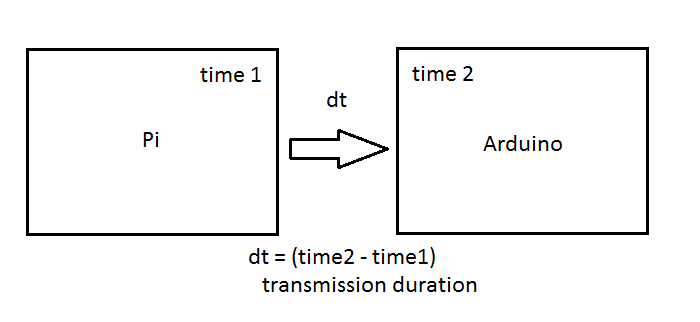
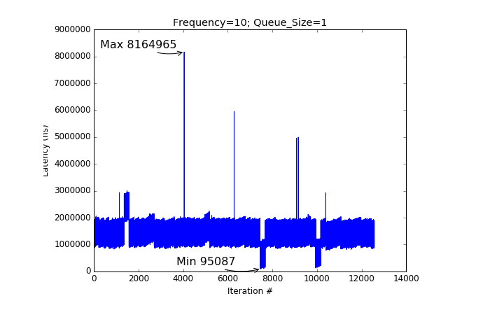

# Serial Latency

## Latency in our Stack

There are significant advantages to using Linux as a complete OS, but there are often reservations about its real-time performance.
The official definition of real-time computing is a task that is executed within a given time, giving a deterministic system. Some applications need only an average response time, while others require that every deadline is met every time.

Given the architecture planned for our robot's stack, the following question is asked:

Can our ROS setup maintain message transmission rates under 0.01s?

* Note: 0.01s restriction is necessary for our control algorithms to run effectively under any choice of parameters mentioned below.

Because we are utilizing Ubuntu (Not a RTOS) on our Pi, our system inherits unknown time delays between processes/tasks. In particular, there is latency in the serial communication between our Pi and our Arduino that we needed to investigate.

Serial data exchanged between the Pi and Arduino is of particular concern to our robot's ability to:

* Avoid obstacles
* Collect data
* Converge to desired velocities, as guided by our control algorithms
* Asynchronous commands (including emergency terminations)

## Parameters
Latency in serial communication across our boards can be considered a function of the following:

* `Physical limits of serial transmission =>` This involves the limits on the Pi and Arduino to transmit and receive serial data, as well on the limits imposed by the transmission cable itself. Because these limits cannot be modified via software, these are not considered parameters in our solution space.
* `ROS topic queue lengths =>` FIFO queues utilized in ROS topic transmissions may cause a message to be processed when it is no longer relevant (seconds, milliseconds late). We want to keep this parameter as small as possible, but not small enough that we lose data necessary for intermittent steps.
* `ROS topic frequencies =>` This parameter (expressed in Hz) dictates how often messages are exchanged, per second. On a full OS, each publisher and subscriber is carried out in its own separate thread. The single-threaded nature of the Arduino introduces additional complexity to our latency calculations, as multiplexing must occur for the Arduino to feature multiple publishers/transmitters.
* `ROS message sizes =>` Inherently, the time taken to transmit a message will be proportional to the size of the message itself.
* `ROS stack serialization time =>` ROS performs XML serialization on messages exchanged between nodes. Although small, it is noteworthy that there is a source of duration associated to serialization between the Arduino and Pi.
* `Serial baud rate =>` the rate at which information is transferred in a communication channel. In the serial port context, "9600 baud" means that the serial port is capable of transferring a maximum of 9600 bits per second. This parameter is bounded by he clock speed on the Arduino.

## Solution Space
Minimal time delays in serial communication, within our stack can be achieved by choosing an optimal combination of: Baud Rate, Message Type (size implied), Topic frequency, and Queue length. The entire solution space consists of all possible combinations of these parameters, which would only be bounded by the physical limits of the boards and cable.

#### Queue Length

* 1, 5, 10, 20, 50, 100

#### Frequency

* 5, 10, 20, 50, 100, 200

#### Baud Rate

* 9600, 57600, 115200, 128000, 256000, 1000000, 2000000

## Procedures

Using python, bash scripting, and Arduino's CLI, we automated the testing of a large portion of the entire solution space.

#### Preliminary Steps
Two dummy scripts were made (Arduino Subscriber & Python Publisher), that served as templates. At each iteration, the templates were used to create a new script (with new parameters) that was deployed and ran using ROS.

## Testing Workflow

NOTE: The red box above is expanded below. This is the data collection process.

## Data Collection and Processing

#### Sample log file

* Our log files collected timestamps that were transmitted via ROS topic, as shown above.
* Using MATLAB and Pandas, we calculated the maximum latency in each test case. We then proceeded to take the maximum latency, form the collection of maximum latencies.

## Findings

#### Maximum latency found

* Our tests concluded that our ROS stack kept transmission times under 0.01s. Our maximum latency came at 8164965ns (0.008s), under the following parameters:

    Frequency: 10Hz | Queue Size: 1 | Baud Rate: 9600

* Test results allowed us to proceed in development knowing that our stack (control algorithms) would perform as intended, given that we remain within the minimum-maximum parameters tested.

## Latency Module

* The entire testing module can be found and ran in our repository, under "latency_module".
