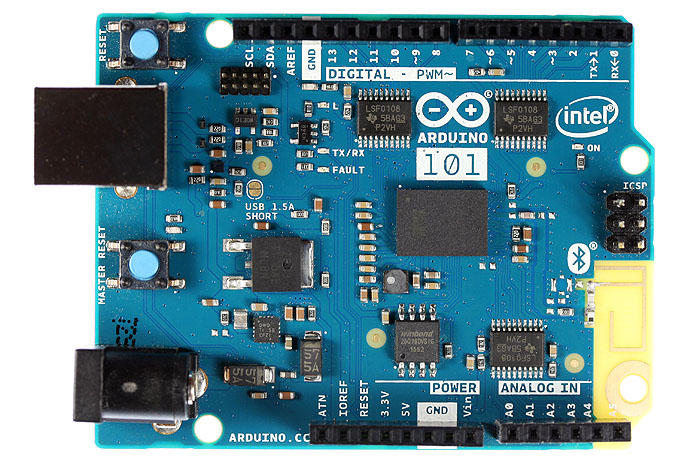
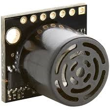
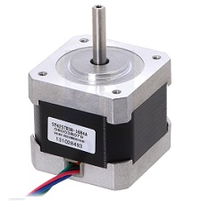
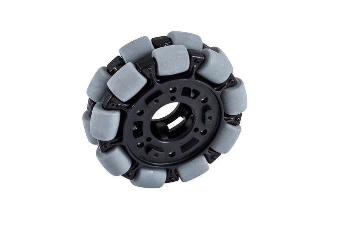

# Components

## Raspberry Pi 3B

* With its high memory and sampling frequency, this was the chosen microcontroller for sensor data collection and internetwork communication. The ultrasound sensor and accelerometer, and other sensors in the future, are attached to the GPIO pins onboard.

## Arduino 101

* The Arduino 101 is the chosen microcontroller for motor control and features an onboard accelerometer and gyroscope.

## Adafruit Motor Shield

* All 3 stepper motors are connected to the Arduino through motor shields.

## HRLZ-MaxSonar-EZ

* The HRLV-MaxSonar-EZ acts as
the distance sensor, which also acts
as the obstacle avoidance sensor.
With a resolution of 1 mm and up to
5 meter max range, it has the
precision and capabilities to find and
avoid obstacles as it is moving.

## NEMA-17 Stepper Motor

* The 12V, 350 mA NEMA-17 Stepper Motors drive the omnidirectional wheels. These motors have two coils, both of which can be activated for maximum torque.

## Omnidirectional Wheel

* The chosen 10.2 cm omnidirectional
wheels are placed in 120° angles from one
another. By placing the wheels at these
angles, combined with each wheel’s
incorporated rollers along the edge of the
wheels, the robot can move in all directions
and not have impeding wheels affecting
motion.
