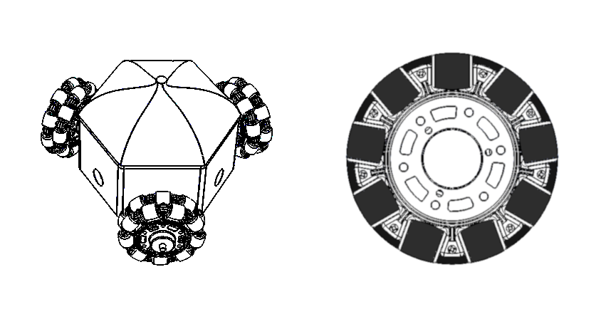

# Overview

<!-- For full documentation visit [mkdocs.org](http://mkdocs.org). -->

## Robot Specifications:

* Constrained radially to 13 cm
* Constrained to a maximum of 26 cm tall, double of radius
* Weighs less than 9 kg
* Operational for at least 2 hours
* Basic motion
* Omnidirectional (ability to move in any direction)
* Ability to avoid obstacles
* Equipped with various sensors for autonomous motion and path-planning capabilities
* Equipped with onboard computing capabilities
* Required to be modular to accommodate future upgrades
* Include an experimental mode where users can upload their own robot control algorithm for testing and learning
